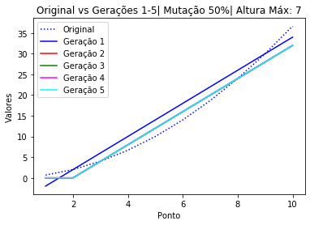
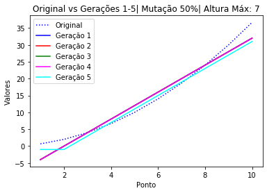

# progGenetica
Algoritmo genético escrito em python.
Foram executadas 5 gerações com 5000 indivíduos iniciais.

Ao rodar o algoritmo com diferentes limites de altura, não percebi muita diferença entre os resultados.
Mas ao rodar o algoritmo com uma taxa de mutação um pouco maior do que a que estava usando (25%) -> (50%), percebi uma leve melhora

Mas mesmo assim nenhum indivíduo chegou na função que encaixava com a original.
